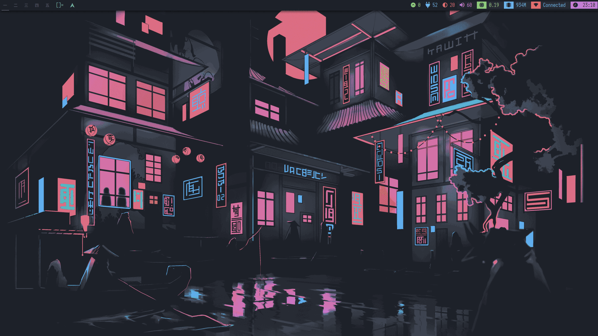
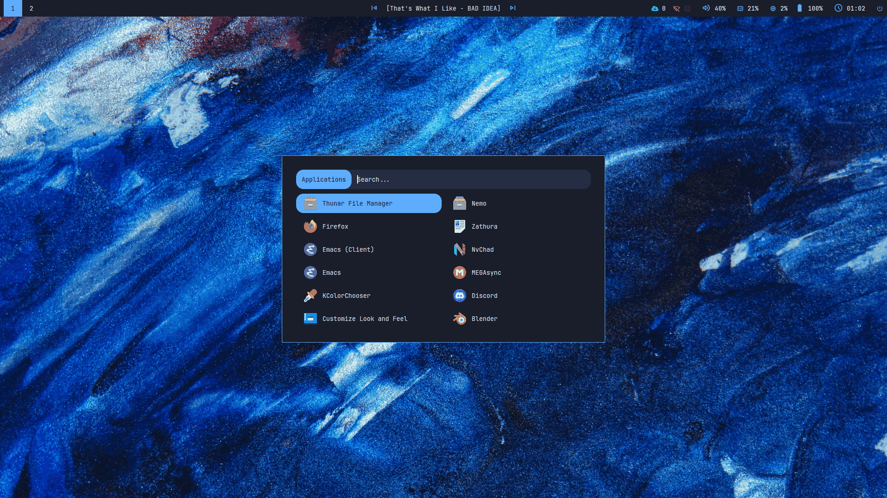
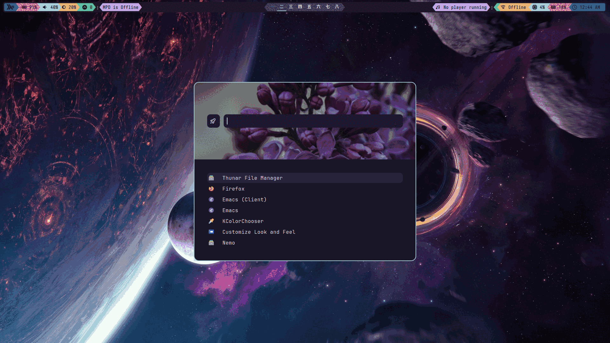
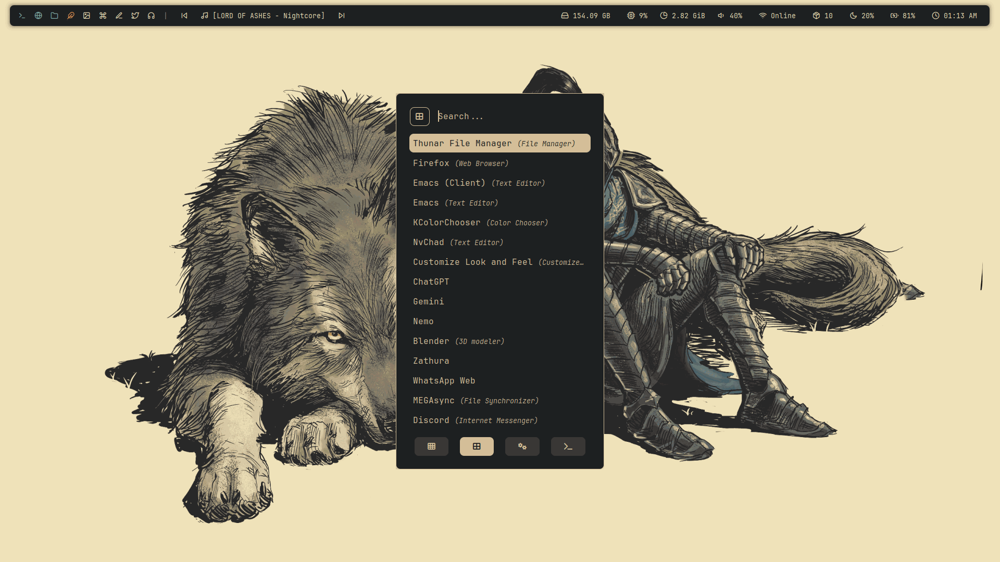
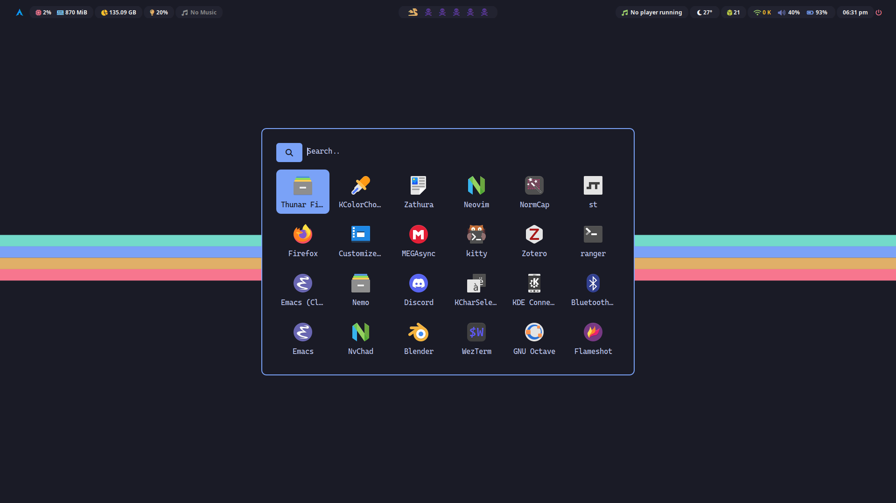
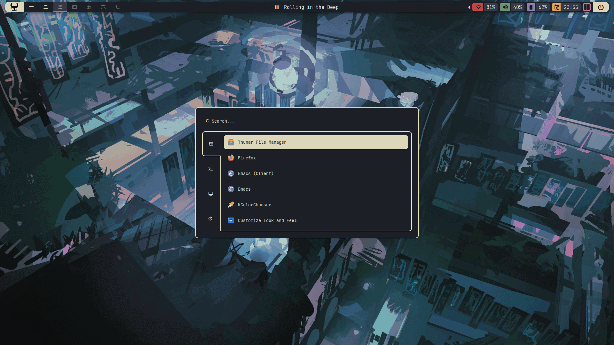
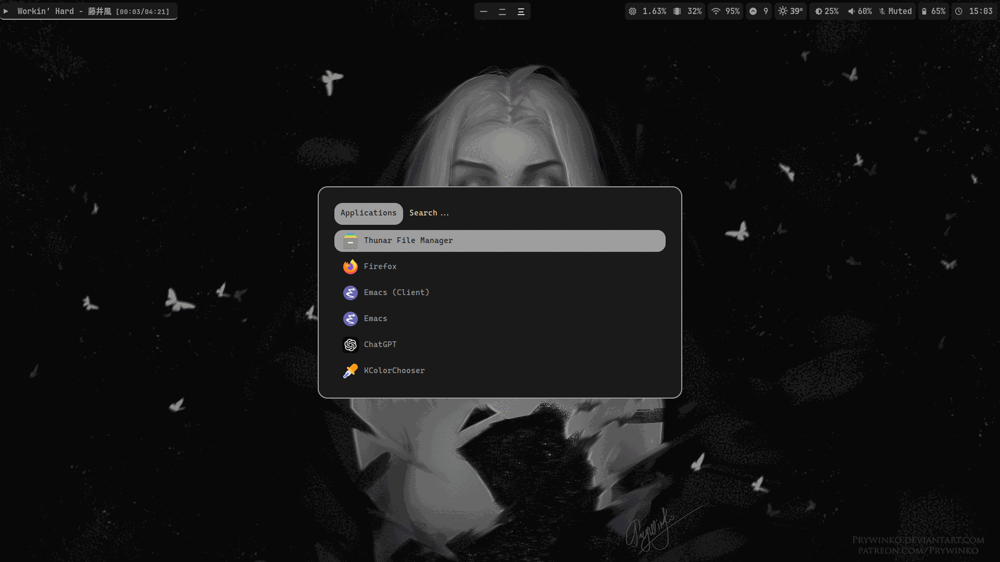
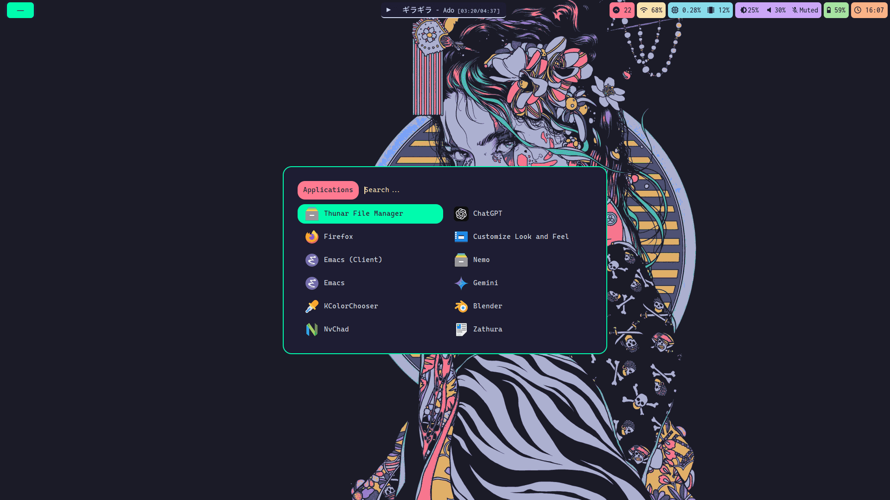
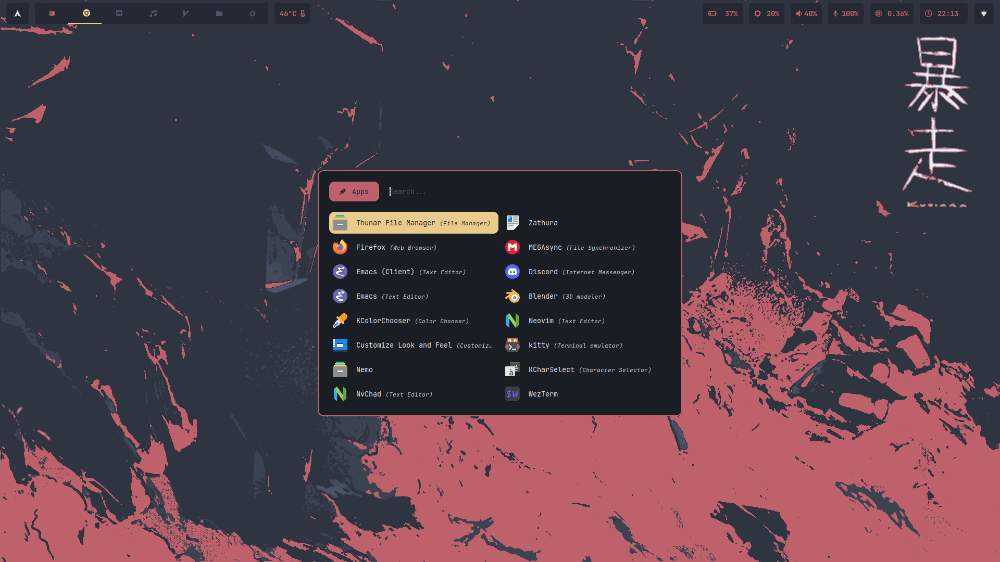

#+title:My dotfiles for Arch linux
This repository contains my custom dotfiles for configuring various aspects of my Linux environment adapted from many other's configs. Everything is configured for my personal use. *Use at your own discretion*.

* Collection
- i3-wm, bspwm, dwm (patched), qtile, xmonad, awesome, hyprland, sway, river
- kitty (main), wezterm, st (dwm)
- picom
- neovim (Nvchad), doom emacs
- polybar, waybar
- rofi, dmenu (minimal)
- eww (minimal)
- dunst
- mpd, mpDris2, ncmpcpp, cava
- neofetch
- zathura
- theme switcher with ~theme.sh~
- startx session manager using ~sess~

* Installation:
Due to the diverse nature of these configurations and potential system variations, there's no one-size-fits-all installation process. However you can carefully examine the files and adapt it to your specific requirements. The below script is only for Arch users.

#+begin_src shell
git clone https://github.com/lumidenoir/dotfiles
cd ./dotfiles
./install.sh
#+end_src

* Images
** dwm

** i3

** xmonad

** awesome

** bspwm

** qtile

** hyprland

** sway

** river

* Credit:
- [[https://github.com/dani-lp/dotfiles][qtile]] config from [[https://github.com/dani-lp][dani-lp]]
- [[https://github.com/darkkal44/Cozytile][cozytile]] config from [[https://github.com/darkkal44][darkkal44]]
- [[https://github.com/siduck/chadwm][dwm]], [[https://github.com/siduck/st][st]], dmenu and [[https://github.com/NvChad/NvChad][nvim]] from [[https://github.com/siduck][siduck]]
- hyprland inspired from [[https://www.reddit.com/r/unixporn/comments/e1etn3/awesome_morpho/][this reddit post]]
- i3 config from [[https://github.com/anufrievroman/dotfiles][@anufrievroman]]
- crylia theme from [[https://github.com/Crylia/crylia-theme][here]]

Thanks and ❤️ to all the wonderful people for posting their dots and helping noobs like me
